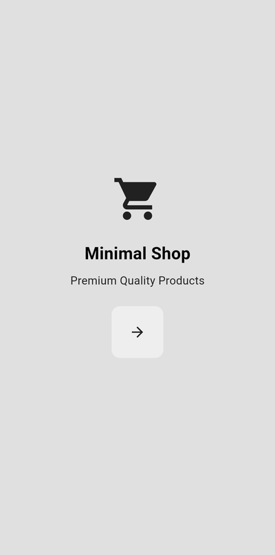
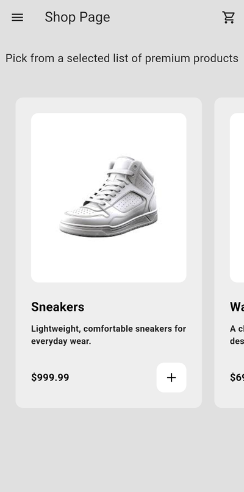
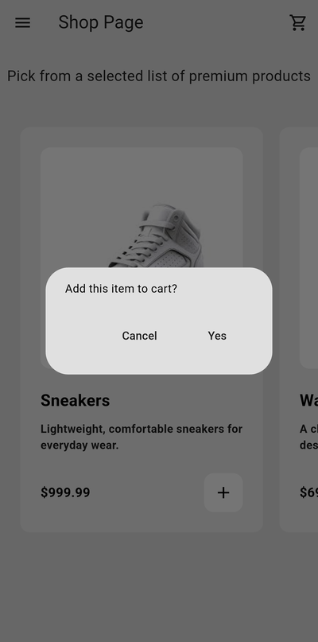
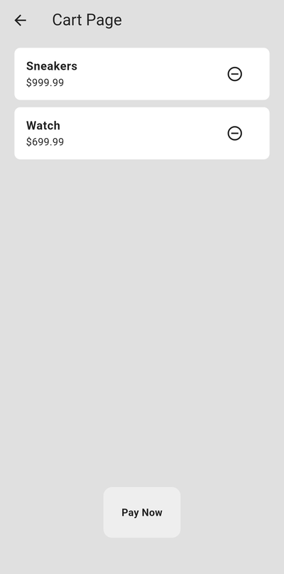
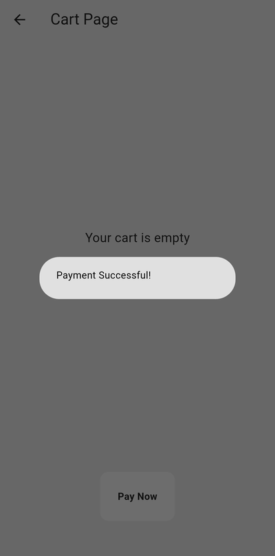
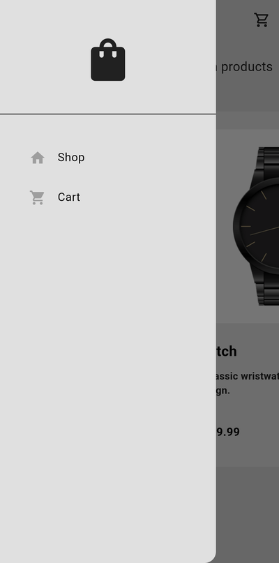

<p align="center">
  
</p>

<h1 align="center">Minimal Shop</h1>

<p align="center">
  Flutter ve Provider ile geliştirilmiş, sade tasarımlı bir alışveriş uygulaması.
</p>

---

Minimal Shop'ta ürünlere göz atabilir, beğendiklerini sepete ekleyebilir ve ödemeyi tamamlayabilirsin. Uygulama gri tonlarda, minimal bir arayüz kullanıyor. Sepet durumu `Provider` ile tüm ekranlarda paylaşılıyor.

## Ekran Görüntüleri

<table>
  <tr>
    <td align="center"></td>
    <td align="center"></td>
    <td align="center"></td>
  </tr>
  <tr>
    <td align="center"><b>Giriş</b><br>Uygulamanın karşılama ekranı</td>
    <td align="center"><b>Mağaza</b><br>Yatay kaydırılabilen ürün kartları</td>
    <td align="center"><b>Sepete Ekleme</b><br>Ürünü eklemeden önce onay</td>
  </tr>
  <tr>
    <td align="center"></td>
    <td align="center"></td>
    <td align="center"></td>
  </tr>
  <tr>
    <td align="center"><b>Sepet</b><br>Eklenen ürünler ve fiyatları</td>
    <td align="center"><b>Ödeme</b><br>Ödeme sonrası sepet boşalır</td>
    <td align="center"><b>Yan Menü</b><br>Mağaza ve sepet arasında geçiş</td>
  </tr>
</table>

## Özellikler

- **Ürün listeleme:** Sneakers, saat, hoodie ve gözlük; her ürün görsel, açıklama ve fiyatla gösterilir.
- **Sepet yönetimi:** Ürün ekleme ve çıkarma, her işlemden önce onay penceresi.
- **Ödeme:** Başarılı ödemeden sonra sepet otomatik boşalır; boş sepetle ödeme yapılamaz.
- **Anlık geri bildirim:** Sepete eklenen ürün için alt bilgi mesajı (SnackBar).
- **Merkezi durum yönetimi:** `ChangeNotifierProvider` ile sepet verisi tüm ekranlarda güncel kalır.
- **Özel tema ve simge:** `light_mode.dart` teması ve bu temaya uygun uygulama simgesi.

## Teknolojiler

| | |
|---|---|
| Framework | [Flutter](https://flutter.dev) (Dart SDK `^3.9.2`) |
| Durum yönetimi | [provider](https://pub.dev/packages/provider) `^6.1.5+1` |
| Uygulama simgesi | [flutter_launcher_icons](https://pub.dev/packages/flutter_launcher_icons) |
| Platformlar | Android, iOS, Web |

## Proje Yapısı

```
lib/
├── main.dart                  # Uygulama girişi, Provider ve sayfa yönlendirmeleri
├── components/                # Tekrar kullanılan arayüz parçaları
│   ├── my_button.dart
│   ├── my_drawer.dart
│   ├── my_list_tile.dart
│   └── my_product_tile.dart
├── models/
│   ├── product.dart           # Ürün modeli
│   └── shop.dart              # Ürün listesi ve sepet mantığı (ChangeNotifier)
├── pages/
│   ├── intro_page.dart        # Giriş
│   ├── shop_page.dart         # Mağaza
│   └── cart_page.dart         # Sepet ve ödeme
└── themes/
    └── light_mode.dart        # Renk teması
assets/                        # Ürün görselleri ve simge kaynakları
test/widget_test.dart          # Birim ve arayüz testleri
tool/generate_icon.py          # Uygulama simgesini üreten betik
```

## Kurulum ve Çalıştırma

```bash
git clone https://github.com/MuratEfeCamoglu/Shoping_app.git
cd Shoping_app
flutter pub get
flutter run
```

Telefona kurulabilir bir APK almak için:

```bash
flutter build apk --release
# Çıktı: build/app/outputs/flutter-apk/app-release.apk
```

## Testler

```bash
flutter test
```

Testler; sepet mantığını, giriş → mağaza → sepete ekleme → sepetten çıkarma akışını ve ödeme davranışını kontrol eder.

## Uygulama Simgesini Yeniden Üretme

Simge, uygulama içinde kullanılan `Icons.shopping_bag` ikonundan ve tema renklerinden üretilir:

```bash
python tool/generate_icon.py      # assets/icon/ altındaki kaynak görseller (Pillow gerekir)
dart run flutter_launcher_icons   # Android, iOS ve Web simgeleri
```
